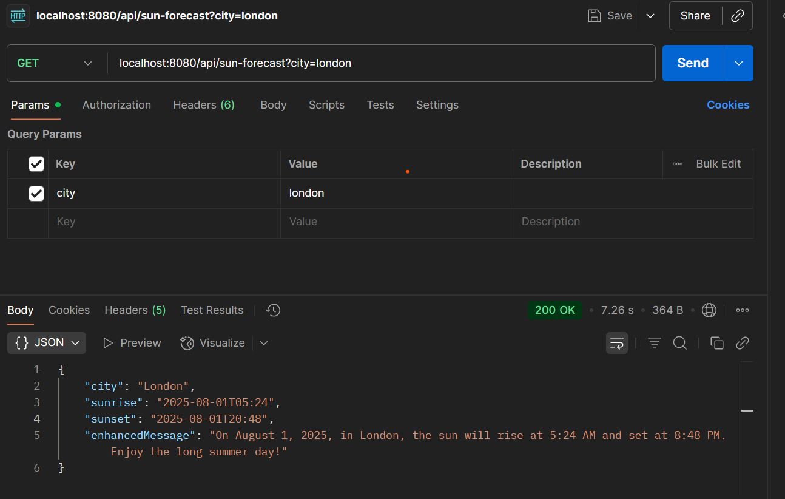

# Sunrise & Sunset Forecast Application

## Overview
This Spring Boot application provides sunrise and sunset times for a given city using the Open-Meteo API, enhanced with natural language explanations via LangChain4j and Azure OpenAI.

## Features
- REST API: `/api/sun-forecast?city={city}`
- Geocoding: Converts city name to coordinates.
- Open-Meteo Integration: Fetches sunrise/sunset times.
- Generative AI: Uses LangChain4j (Azure OpenAI) for user-friendly explanations.
- Input validation and error handling.
- Unit tests with JUnit & Mockito.

## Setup Instructions
1. **Clone the repository**
2. **Configure Azure OpenAI**
   - Set your Azure OpenAI endpoint and key in `application.properties`:
     ```properties
     langchain4j.azure.openai.endpoint=https://YOUR_AZURE_OPENAI_ENDPOINT
     langchain4j.azure.openai.key=YOUR_AZURE_OPENAI_KEY
     langchain4j.azure.openai.deployment=YOUR_DEPLOYMENT_NAME
     ```
3. **Build and Run**
   ```bash
   ./gradlew build
   ./gradlew bootRun
   ```
4. **Test**
   ```bash
   ./gradlew test
   ```

## API Usage
- **Request:** `GET /api/sun-forecast?city=Berlin`
- **Response:**
  ```json
  {
    "city": "Berlin",
    "sunrise": "2025-08-01T08:55:00+05:30",
    "sunset": "2025-08-01T00:30:00+05:30",
    "enhanced_message": "Tomorrow in Berlin, the sun will rise at 8:55 AM IST and set at 12:30 AM IST. Enjoy the golden hour!"
  }
  ```


## Architecture
- **Controller:** Handles REST requests.
- **Service:** Integrates with geocoding and Open-Meteo APIs.
- **AI Assistant:** Uses LangChain4j to generate explanations.
- **DTOs:** For structured data transfer.

## Dependencies
- Spring Boot
- LangChain4j (Azure OpenAI)
- JUnit, Mockito

## Contact
Ping me directly or email

